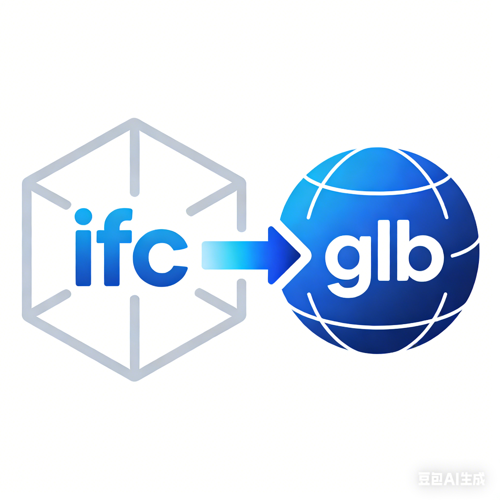

# ifc2glb - IFC 到 GLB 格式转换工具

<p align="center">
  
</p>

<h3 align="center">专业的 BIM 模型格式转换工具</h3>

<p align="center">
  <a href="#"></a>
  <a href="#"></a>
</p>

---

## 简体中文

### 简介

ifc2glb 是一个专业级的 BIM 模型格式转换工具，专门用于将 IFC (Industry Foundation Classes) 格式的建筑信息模型转换为 GLB (GL Transmission Format) 格式。该工具能够保留原始模型的几何信息、材质属性以及构件信息，并提供多种转换模式以满足不同的应用需求。

### 核心特性

- **高保真转换**: 精确保留原始 IFC 模型的几何形状、材质和属性信息
- **多种转换模式**: 提供基础转换、数模分离、法线增强等多种转换选项
- **数模分离**: 将模型数据与属性数据分离存储，提高加载效率
- **法线处理**: 对每个三角面片计算独立法线，确保渲染质量
- **批量处理**: 支持单文件转换和批量处理模式
- **跨平台**: 基于 Python 开发，可在多种操作系统上运行

### 安装

1. 克隆项目仓库：

```bash
git clone <repository-url>
cd ifc2glb
```

2. 安装依赖：

```bash
pip install -r requirements.txt
```

3. 注意事项：
   首次使用需要修改 gltflib 库：在 `gltflib.models.attributes` 类中添加属性 `_BATCHID: Optional[int] = None`

### 快速开始

直接运行 `ifc2glb.py` 即可进行转换工作：

```bash
python ifc2glb.py
```

默认会转换 `./resource/IfcWall.ifc` 文件，您可以在 `ifc2glb.py` 中修改要转换的文件路径。

### 核心模块说明

`ifc2glb.py` 是运行的主函数，通过导入不同的核心模块来实现不同的转换功能：

- **core.main**: 基础转换功能，将 IFC 模型转换为 GLB 格式
- **core.main_batchid_mesh_types_separation**: 在基础转换功能基础上，为 mesh 添加 batch id，便于在 WebGL 中进行批处理选择
- **core.main_separation**: 在基础转换功能基础上进行数模分离，将模型数据（GLB 文件）和构件信息（JSON 文件）分开存储
- **core.main_separation_NormalLine**: 在基础转换功能基础上进行数模分离，并新增法线数据（模型体积变大但显示更真实）

目前 `ifc2glb.py` 默认使用 `core.main_separation_NormalLine` 模块，如需切换其他功能，只需在 `ifc2glb.py` 中注释掉当前导入行，取消注释相应的导入行即可。

### 输出结构

转换完成后，将在 `output` 目录下生成以下文件：

- `gltf/`: 包含 GLTF 格式的模型文件
- `glb/`: 包含 GLB 格式的模型文件
- `data/`: 包含构件属性和楼层树结构的 JSON 文件

### 技术架构

- **核心转换**: 基于 ifcopenshell 和 gltflib 库实现
- **数据处理**: 采用多进程处理提高转换效率

### 许可证

本项目为专有软件，未经授权不得擅自使用、复制或分发。All Rights Reserved（保留所有权利）许可证。

核心代码已隐藏，本仓库只作为使用文档展示。

---

## English

### Introduction

ifc2glb is a professional-grade BIM model format conversion tool specifically designed to convert IFC (Industry Foundation Classes) format building information models to GLB (GL Transmission Format). This tool preserves the geometric information, material properties, and component information of the original model, and provides multiple conversion modes to meet different application requirements.

### Key Features

- **High-fidelity Conversion**: Accurately preserves geometric shapes, materials, and property information of the original IFC model
- **Multiple Conversion Modes**: Provides basic conversion, data-model separation, normal enhancement and other conversion options
- **Data-Model Separation**: Separates model data from property data for improved loading efficiency
- **Normal Processing**: Calculates independent normals for each triangle face to ensure rendering quality
- **Batch Processing**: Supports both single file conversion and batch processing modes
- **Cross-platform**: Developed in Python for operation on multiple operating systems

### Installation

1. Clone the repository:

```bash
git clone <repository-url>
cd ifc2glb
```

2. Install dependencies:

```bash
pip install -r requirements.txt
```

3. Note:
   First-time users need to modify the gltflib library: Add the attribute `_BATCHID: Optional[int] = None` to the `gltflib.models.attributes` class

### Quick Start

Run `ifc2glb.py` directly to perform conversion:

```bash
python ifc2glb.py
```

By default, it will convert the `./resource/IfcWall.ifc` file. You can modify the file path to be converted in `ifc2glb.py`.

### Core Modules Explanation

`ifc2glb.py` is the main function that implements different conversion functions by importing different core modules:

- **core.main**: Basic conversion function that converts IFC models to GLB format
- **core.main_batchid_mesh_types_separation**: Based on the basic conversion function, adds batch id to meshes for batch processing selection in WebGL
- **core.main_separation**: Based on the basic conversion function, performs data-model separation, storing model data (GLB files) and component information (JSON files) separately
- **core.main_separation_NormalLine**: Based on the basic conversion function, performs data-model separation and adds normal data (larger model size but more realistic display)

Currently, `ifc2glb.py` uses the `core.main_separation_NormalLine` module by default. To switch to other functions, simply comment out the current import line in `ifc2glb.py` and uncomment the corresponding import line.

### Output Structure

After conversion, the following files will be generated in the `output` directory:

- `gltf/`: Contains GLTF format model files
- `glb/`: Contains GLB format model files
- `data/`: Contains JSON files with component properties and floor tree structure

### Technical Architecture

- **Core Conversion**: Implemented based on ifcopenshell and gltflib libraries
- **Data Processing**: Multi-process processing adopted to improve conversion efficiency

### License

This project is proprietary software. Unauthorized use, copying, or distribution is prohibited.This project is licensed under All Rights Reserved. Unauthorized use, copying, or distribution is prohibited.
